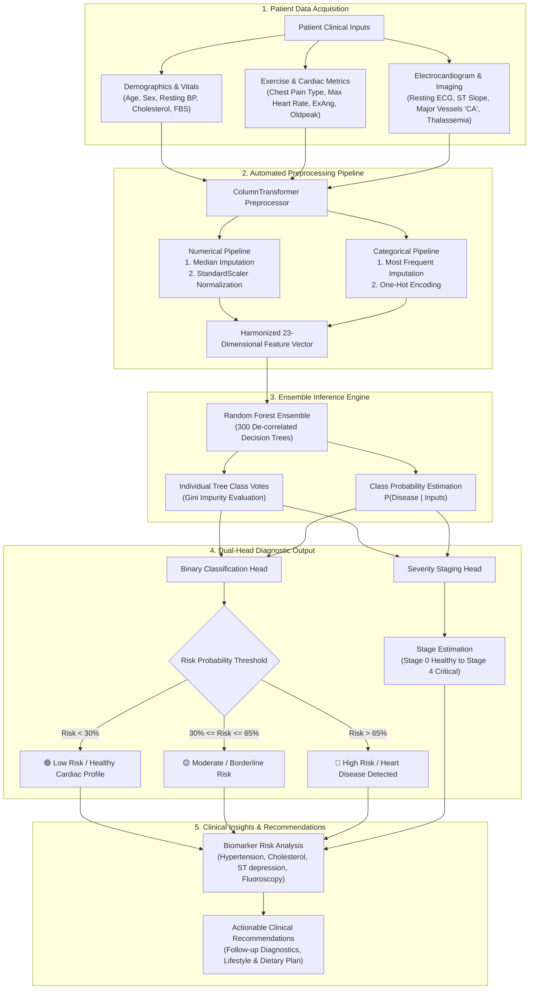

# ❤️ Heart Disease Predictor & Diagnostic Assistant

An intelligent Clinical Decision Support System (CDSS) powered by Machine Learning and Streamlit, trained on the comprehensive **UCI Heart Disease Benchmark Dataset** (919 clinical records across Cleveland, Hungary, Switzerland, and VA Long Beach).

---

## 🚀 Features

- **High-Accuracy Classification**: Employs an optimized **Random Forest Classifier Pipeline** with median imputation, standard scaling, and one-hot encoding (~83.3% test accuracy, 0.923 ROC-AUC).
- **Dual Diagnosis & Risk Scoring**:
  - Binary Diagnosis: Absence (Low Risk / Healthy) vs Presence (High Risk / Disease Detected).
  - Risk Probability: Exact percentage likelihood of cardiovascular disease.
  - Severity Staging: Multiclass estimation (Healthy, Stage 1 Mild, Stage 2 Moderate, Stage 3 Severe, Stage 4 Critical).
- **Personalized Risk Factor Breakdown**: Automated analysis of high blood pressure, cholesterol, exercise angina, ST depression, and fluoroscopy findings.
- **Actionable Health Recommendations**: Evidence-based cardiovascular wellness advice and clinical follow-up guidance.
- **One-Click Patient Presets**: Instantly load healthy, borderline, and high-risk patient profiles for rapid testing.
- **Modern Responsive Web UI**: Crafted with intuitive tabs, real-time metrics, risk badges, and probability visualization.

---

## 🧠 How It Detects Heart Disease

The system utilizes a multi-stage machine learning inference pipeline designed to analyze clinical measurements, cardiovascular stress indicators, and electrophysiological signals.



### Detailed Detection Workflow

1. **Clinical Data Ingestion**:
   - The user inputs 13 clinical biomarkers covering baseline hemodynamics (blood pressure, fasting blood sugar), serum lipid profiles (cholesterol), exercise tolerance (maximum heart rate, exercise-induced angina), and diagnostic modalities (12-lead ECG, fluoroscopy vessel staining, and thallium stress scintigraphy).

2. **Automated Feature Preprocessing & Transformation**:
   - **Numerical Features** (`age`, `trestbps`, `chol`, `thalch`, `oldpeak`, `ca`):
     - Missing data points are imputed using median statistical values to resist extreme outliers.
     - Features are normalized with `StandardScaler` ($z = \frac{x - \mu}{\sigma}$), placing all measurements onto a uniform zero-mean, unit-variance scale.
   - **Categorical Features** (`sex`, `cp`, `fbs`, `restecg`, `exang`, `slope`, `thal`):
     - Imputed with the most frequent category.
     - One-hot encoded into binary vectors to eliminate artificial ordinal assumptions.

3. **Random Forest Ensemble Decision Process**:
   - The processed feature vector is passed to an ensemble of **300 de-correlated decision trees**.
   - During training, each tree is built on bootstrapped subsets of patients (Bagging), evaluating randomized feature subsets at each split point to minimize correlation between trees.
   - For an incoming patient, each tree traverses root-to-leaf decision nodes based on thresholds learned from clinical patterns (e.g. `ST depression > 1.45 mm` + `asymptomatic chest pain` + `reversable thallium defect`).
   - The ensemble aggregates probability estimates:
     $$P(\text{Heart Disease} \mid \mathbf{x}) = \frac{1}{B} \sum_{b=1}^{B} p_b(\text{Heart Disease} \mid \mathbf{x})$$

4. **Multi-Tier Diagnostic Staging**:
   - **Binary Diagnosis**: Identifies whether coronary artery disease ($\ge 50\%$ diameter narrowing) is present.
   - **Severity Staging**: Predicts the specific anatomical severity stage (Stage 0 to Stage 4) using the multiclass classification head.
   - **Confidence Score**: Reports the exact probability percentage for transparent clinical decision support.

5. **Risk Factor Extraction & Guidance**:
   - Rule-based diagnostic checks evaluate individual parameters against established clinical guidelines (AHA/ACC):
     - **Hypertension**: Identifies Stage 1 ($\ge 130$ mm Hg) or Stage 2 ($\ge 140$ mm Hg) blood pressure.
     - **Hypercholesterolemia**: Flags serum cholesterol $\ge 200$ mg/dl (borderline) or $\ge 240$ mg/dl (elevated).
     - **Ischemic Response**: Highlights exercise-induced chest tightness (`exang = True`) and ST-segment depression (`oldpeak $\ge 1.5$ mm`).
     - **Coronary Calcification**: Flags major vessel count colored via fluoroscopy (`ca > 0`).

---

## 🛠️ Project Structure

```text
├── Models/
│   ├── best_classification_model.pkl   # Fitted production Scikit-Learn Pipeline
│   └── model_metadata.json             # Model metrics, feature definitions, and stages
├── Training/
│   ├── Heart_Detection.ipynb           # Original exploration & training notebook
│   └── heart_disease_uci.csv           # Cleaned UCI benchmark dataset (919 rows)
├── app.py                              # Streamlit web application
├── README.md                           # Documentation
```

---

## 📊 Input Clinical Attributes

| Feature | Name | Clinical Description / Categories |
|---|---|---|
| `age` | Age | Patient age in years (18 - 100) |
| `sex` | Biological Sex | `Male` or `Female` |
| `cp` | Chest Pain Type | `typical angina`, `atypical angina`, `non-anginal`, `asymptomatic` |
| `trestbps` | Resting Blood Pressure | mm Hg upon admission (Normal: < 120 mm Hg) |
| `chol` | Serum Cholesterol | mg/dl (Desirable: < 200, Elevated: >= 240 mg/dl) |
| `fbs` | Fasting Blood Sugar | `True` (> 120 mg/dl) or `False` (<= 120 mg/dl) |
| `restecg` | Resting ECG | `normal`, `st-t abnormality`, `lv hypertrophy` |
| `thalch` | Max Heart Rate Achieved | bpm during exercise stress test (60 - 220 bpm) |
| `exang` | Exercise-Induced Angina | `True` (Yes) or `False` (No) |
| `oldpeak` | ST Depression | mm induced by exercise relative to resting baseline |
| `slope` | ST Segment Slope | `upsloping` (normal), `flat` (ischemia), `downsloping` (severe) |
| `ca` | Major Vessels (Fluoroscopy) | Number of colored vessels (0 to 3) |
| `thal` | Thallium Scintigraphy | `normal`, `fixed defect`, `reversable defect` |

---

## 🏃 Running the Application

### 1. Ensure Dependencies are Installed
```bash
pip install streamlit pandas scikit-learn joblib xgboost
```

### 2. Launch the Streamlit Web Application
```bash
streamlit run app.py
```

### 3. Open in Browser
Visit **[http://localhost:8501](http://localhost:8501)** in your web browser.

---

## ⚠️ Medical Disclaimer
This application is developed strictly for research, educational, and clinical demonstration purposes. It should not be utilized as a substitute for professional medical advice, clinical diagnosis, or patient management by qualified healthcare providers.
